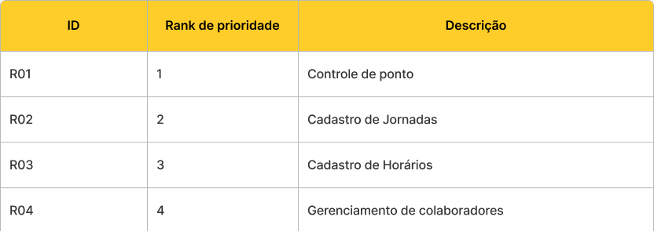
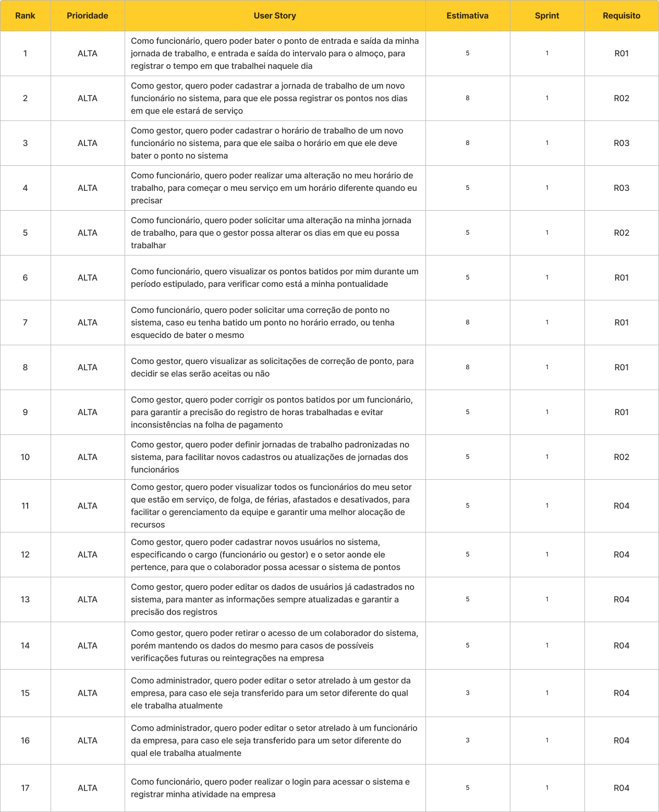
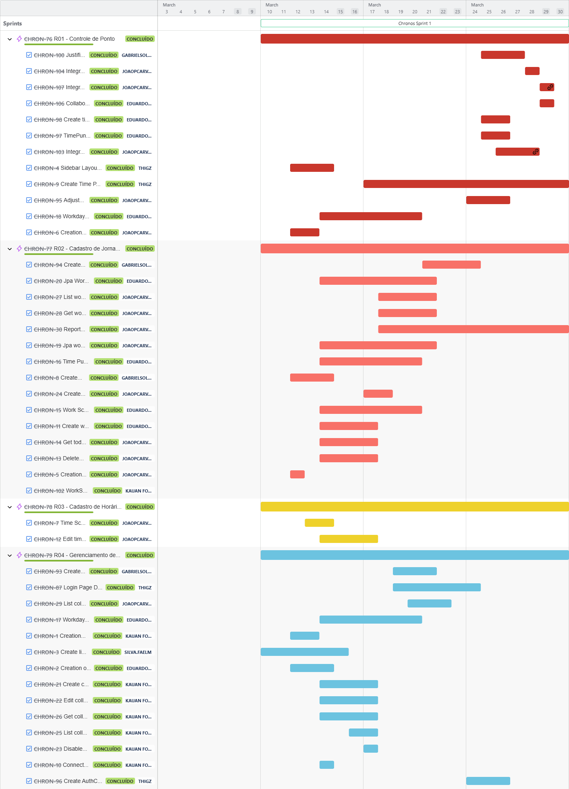
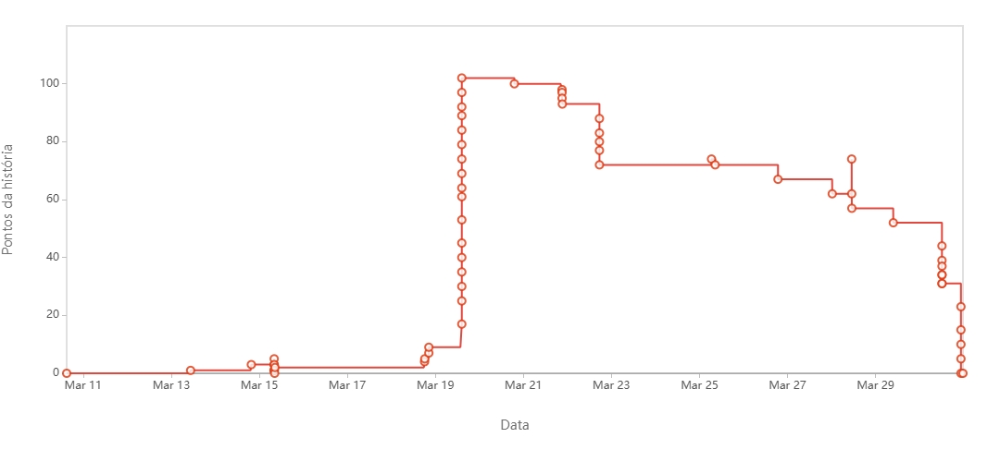

# Sprint - 1️⃣

## Requisitos realizados nessa sprint ✨

## User Stories realizados nessa sprint 📖

## Critérios de aceitação para cada User Story 📒

### US01

- O ponto deve ser lançado no sistema como: 
  - Horário de entrada 1 
  - Horário de saída 1
  - Horário de entrada 2
  - Horário de saída 2
  - Data
- O sistema não deve impedir o ponto de ser batido
- O ponto pode ser editado posteriormente pelo gestor

### US02

- A jornada deve ser cadastrada contendo: 
  - Dias da semana nos quais o colaborador irá trabalhar
  - Dia(s) da semana aonde o colaborador foiga
- Só pode ser editado pelo gestor
- Pode ser definida a partir das jornadas padrão cadastradas anteriormente pelo gestor, ou manualmente

### US03

- O horário deve ser cadastrado contendo: 
  - Horário de Entrada 1
  - Horário de Saída 1 (Entrada almoço)
  - Horário de Entrada 2 (Saída almoço)
  - Horário de Saída 2
- Gestor deve fazer o primeiro cadastro
- O horário pode ser editado pelo próprio funcionário caso ele deseje
- A marcação dos pontos diários deve ser fechada 2 horas e 10min após o horário definido na Saída 2

### US04

- O funcionário deve realizar a alteração especificando: 
  - Novo horário de Entrada 1
  - Novo horário de Saída 1 (Entrada almoço)
  - Novo horário de Entrada 2 (Saída almoço)
  - Novo horário de Saída 2
- A alteração precisa ser registrada

### US05

- O funcionário deve solicitar a alteração ao gestor especificando: 
  - Dias da semana em serviço
  - Dias da semana em folga
  - Justificativa para a alteração
- Gestor decide se aprova ou não
- Gestor pode fazer alterações antes de aprovar
- A alteração precisa ser registrada

### US06

- Quando o funcionário acessar a página de histórico de pontos, ele deve primeiramente visualizar: 
  - Todos os pontos batidos por ele no dia atual
  - Todos os pontos batidos nos dias da semana atual
- O funcionário pode filtrar um período de dias em que ele queira visualizar os pontos batidos
- Solicitações de ponto pendentes e pontos negados devem ser visualizados dentro do dia específico em que eles foram criados

### US07

- O funcionário deve solicitar a correção de ponto ao gestor especificando: 
  - Horário de ponto a ser adicionado
  - Dia em que o novo ponto será adicionado
  - Justificativa para a alteração
- Gestor decide se aprova ou não
- Gestor pode fazer alterações antes de aprovar
- A alteração precisa ser registrada

### US08

- O gestor deve visualizar na página de correções:
  - Solicitações pendentes
  - Nome do funcionário que solicitou a correção
  - Data e hora da solicitação
- Deve haver um histórico de alterações recentes

### US09

- O gestor deve visualizar no formulário de correção:
  - Justificativa do funcionário
  - Documentos anexados(se houver)
  - Data e hora da solicitação
  - Pontos batidos pelo funcionário no dia da solicitação
- O gestor precisa fazer o lançamento de um ponto no formulário para aquele funcionário, contendo:
  - Horário do ponto
  - Data e hora
  - Observação
  - Ponto a ser substituído(no caso de ter 4 pontos ou mais)

### US10

- A jornada padrão deve ser cadastrada contendo:
  - Nome da jornada
  - Descrição 
  - Dias da semana nos quais o colaborador irá trabalhar
  - Dia(s) da semana aonde o colaborador folga
- Só pode ser editado pelo gestor
- Pode ser excluída sem afetar as jornadas definidas para os colaboradores

### US11

- A tela de análise geral deve conter uma relação geral entre:
  - Colaboradores em jornada ativa
  - Colaboradores de folga no dia atual
  - Colaboradores em período de férias
  - Colaboradores afastados
- Deve haver uma relação entre os colaboradores em período de férias, mostrando o período de férias estipulado para cada um deles
- Deve haver uma relação entre os colaboradores afastados, mostrando o período de dias estipulado em que ele ficará afastado da empresa, e uma justificativa
- Deve ser possível visualizar usuários desativados no sistema, mostrando a data de desligamento de cada conta em questão

### US12

- A criação de conta deve ser feita via formulário contendo os campos:
  - Nome;
  - E-mail;
  - CPF
  - Senha
  - Cargo (Gestor/Funcionário)
  - Setor que o funcionário pertence.
- A conta não pode ser criada caso haja uma outra conta com os mesmos dados abaixo:
  - E-mail;
  - CPF

### US13

- A conta de um usuário pode ser editada via formulário nos campos:
  - Nome;
  - E-mail;
  - CPF
  - Senha
  - Cargo (Gestor/Funcionário)
- A conta não pode ser editada caso haja uma outra conta com os mesmos dados abaixo:
  - E-mail;
  - CPF

### US14

- A conta deve ser desativada no sistema, e não excluída. Ela não terá mais acesso às páginas do sistema, e não irá aparecer nas telas de análise do gestor, assim como nos relatórios.

### US15

- O setor deve ser editado no formulário de edição da conta do gestor.

### US16

- O setor deve ser editado no formulário de edição da conta do funcionário .

### US17

- Ao realizar o login, o funcionário deve ser direcionado para a página de ponto.

### Tasks realizados nessa sprint

## Gráfico Burndown 📈

## Slides para apresentação 🎞️

**<a href="https://www.canva.com/design/DAGjWhlAcv8/B-Rzn10w9m8CKFFkdYPMCg/edit?utm_content=DAGjWhlAcv8&utm_campaign=designshare&utm_medium=link2&utm_source=sharebutton" _target="blank" download="sprint-1-apresentacao">Clique para acessar a apresentação no Canva</a>**