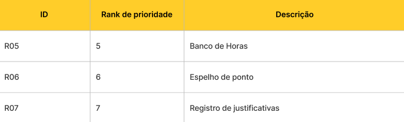
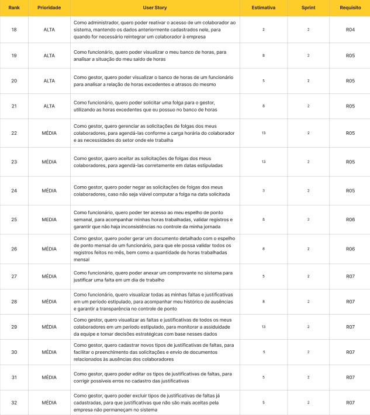
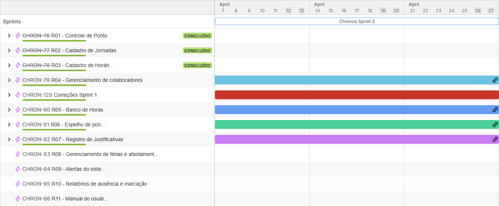
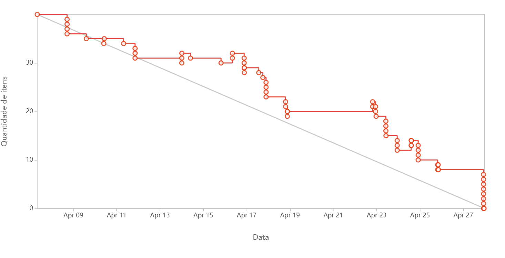

# Sprint - 2️⃣

## Requisitos realizados nessa sprint ✨

## User Stories realizados nessa sprint 📖

## Critérios de aceitação para cada User Story 📒

### US01

- O administrador deve poder reativar o acesso de um colaborador ao sistema.
- Os dados anteriormente cadastrados no colaborador devem ser mantidos no sistema.
- A reativação serve para reintegração do colaborador à empresa.

### US02

- O funcionário deve poder visualizar seu próprio banco de horas.
- O banco de horas deve mostrar a situação do saldo de horas.

### US03

- O gestor deve poder visualizar o banco de horas dos funcionários.
- O banco de horas deve mostrar a relação de horas excedentes e atrasos dos funcionários.

### US04

- O funcionário deve poder solicitar folga ao gestor.
- A solicitação de folga deve utilizar as horas excedentes disponíveis no banco de horas.

### US05

- O gestor deve gerenciar as solicitações de folgas dos colaboradores.
- As folgas devem ser agendadas conforme a carga horária do colaborador e as necessidades do setor onde ele trabalha.

### US06

- O gestor deve aceitar as solicitações de folgas dos colaboradores.
- As folgas aceitas devem ser agendadas corretamente nas datas estipuladas.

### US07

- O gestor deve poder negar as solicitações de folgas dos colaboradores.
- Caso a folga solicitada não seja viável para a data, o gestor pode rejeitar.

### US08

- O funcionário deve poder acessar o espelho de ponto semanal.
- O espelho de ponto deve mostrar as horas trabalhadas, registros feitos, e validar se existem inconsistências.

### US09

- O gestor deve poder gerar um documento detalhado com o espelho de ponto mensal de um funcionário.
- O documento deve apresentar todos os registros do mês e a quantidade de horas trabalhadas.

### US10

- O funcionário deve poder anexar um comprovante no sistema para justificar uma falta em um dia de trabalho.

### US11

- O funcionário deve visualizar todas as faltas e justificativas em um período estipulado.
- O funcionário deve acompanhar o histórico de ausências e garantir a transparência no controle de ponto.

### US12

- O gestor deve visualizar todas as faltas e justificativas de todos os colaboradores em um período estipulado.
- O gestor deve monitorar a assiduidade da equipe e estabelecer estratégias de gestão com base nesses dados.

### US13

- O gestor deve poder cadastrar novos tipos de justificativas de faltas.
- As novas justificativas devem facilitar a solicitação e o controle de ausências no sistema.

### US14

- O gestor deve poder editar os tipos de justificativas de faltas.
- Correções nos cadastros das justificativas devem ser possíveis.

### US15

- O gestor deve poder excluir tipos de justificativas de faltas já cadastradas.
- Justificativas que não são mais aceitas pela empresa não devem permanecer no sistema.

### Tasks realizados nessa sprint

## Gráfico Burndown 📈

## Slides para apresentação 🎞️

**<a href="https://www.canva.com/design/DAGjWhlAcv8/B-Rzn10w9m8CKFFkdYPMCg/edit?utm_content=DAGjWhlAcv8&utm_campaign=designshare&utm_medium=link2&utm_source=sharebutton" _target="blank" download="sprint-1-apresentacao">Clique para acessar a apresentação no Canva</a>**