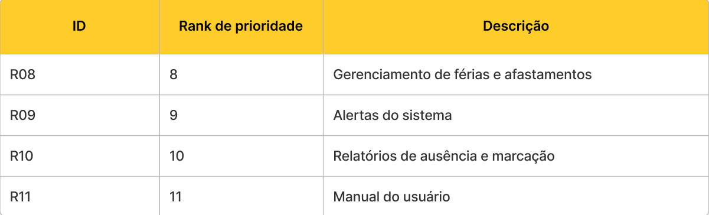
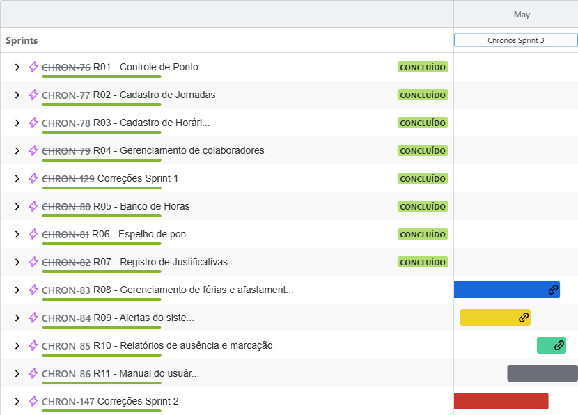
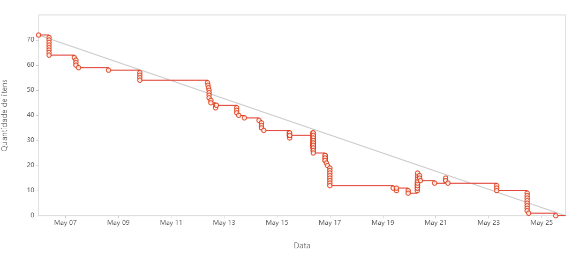

# Sprint - 3️⃣

## Requisitos realizados nessa sprint ✨

## User Stories realizados nessa sprint 📖

## Critérios de aceitação para cada User Story 📒

### US 33

- O funcionário deve poder receber suas horas extras através do saldo no banco de horas.
- O sistema deve registrar essas horas como bonificação no próximo pagamento.

### US 34

- O funcionário deve poder solicitar férias dentro de um período estipulado.
- A solicitação deve ajudar no planejamento do descanso e permitir que o gestor organize a equipe.
- O funcionário deve poder cancelar uma solicitação registrada, como férias ou folga, caso mude de planos.

### US 35

- O gestor deve poder gerenciar e aprovar as solicitações de férias dos colaboradores dentro de um período estipulado.
- O gestor deve visualizar um calendário com as férias agendadas da equipe para evitar sobreposições.
- O gestor deve poder registrar as férias dos colaboradores para fins legais e administrativos.

### US 36

- O funcionário deve receber notificações quando seu saldo de horas for atualizado.
- O sistema deve alertá-lo para garantir que esteja ciente das alterações no banco de horas.

### US 36

- O funcionário deve receber uma notificação para preencher a justificativa de uma falta no banco de horas.
- A notificação deve evitar prejuízo no total de horas por falta de justificativa.

### US 37

- O funcionário deve receber uma notificação quando sua solicitação de folga ou férias for aprovada.

### US 38

- O gestor deve receber uma notificação sobre solicitações em aberto de colaboradores, para garantir resposta rápida.

### US 39

- O gestor deve visualizar relatórios com os colaboradores que possuem horas faltantes em um período estipulado.
- Os dados devem permitir o monitoramento da frequência da equipe e embasar decisões estratégicas.

### US 40

- O gestor deve visualizar todas as marcações de ponto realizadas em um dia específico.
- Isso deve permitir o acompanhamento da presença geral da equipe.

### US 41

- O gestor deve ter acesso a um manual com todas as funcionalidades do sistema.
- O manual deve apoiar o treinamento de novos funcionários e gestores.

### US 42

- O gestor deve visualizar relatórios com dados de faltas e afastamentos dos colaboradores em um período estipulado.
- O gestor deve poder registrar as informações de férias e afastamentos para fins legais e administrativos.

### US 43

- O funcionário deve poder registrar um afastamento (como por doença, maternidade, etc.) dentro de um período de dias.
- O gestor deve poder aprovar afastamentos mediante apresentação de atestado ou justificativas.
- O funcionário deve poder consultar seu histórico de férias e afastamentos.

### Tasks realizados nessa sprint

## Gráfico Burndown 📈

## Slides para apresentação 🎞️

**<a href="https://www.canva.com/design/DAGjWhlAcv8/B-Rzn10w9m8CKFFkdYPMCg/edit?utm_content=DAGjWhlAcv8&utm_campaign=designshare&utm_medium=link2&utm_source=sharebutton" _target="blank" download="sprint-1-apresentacao">Clique para acessar a apresentação no Canva</a>**